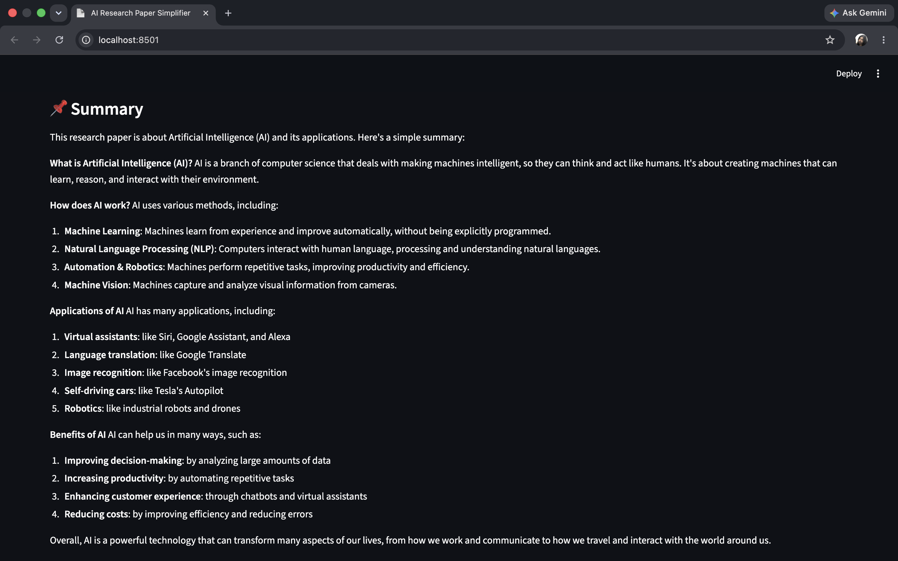
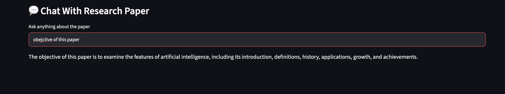

# AI Research Paper Simplifier

An AI-powered research paper analysis tool built using Python, Streamlit, Groq API (Llama 3.3 70B), and NLP techniques.

## Features

* Research Paper Summary
* Keyword Extraction
* Viva Question Generation
* Beginner-Friendly Explanation
* Difficulty Analysis
* Prerequisite Identification
* Chat with Research Paper

## Tech Stack

* Python
* Streamlit
* Groq API
* Llama 3.3 70B
* YAKE
* PyPDF2

## How to Run

```bash
pip install -r requirements.txt
streamlit run app.py
```

## Project Structure

```text
AI_Research_Paper_Simplifier
│
├── app.py
├── config.py
├── services
├── utils
└── requirements.txt
## Screenshots

### Home Page


### Summary



### Keywords


### Viva Questions


### Beginner Explanation


### Difficulty Analysis


### Chat With Research Paper

